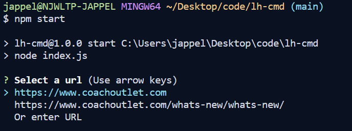
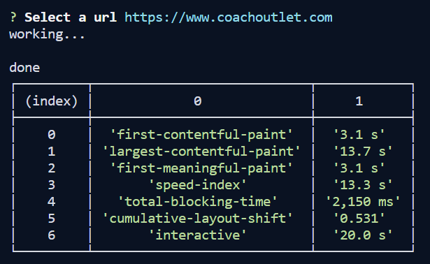
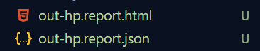

# lh-cmd

## Clone repo and npm install

### Have Lighthouse installed

It is not a listed dependency in this project - install globally first `npm install -g lighthouse`

### Steps

1. npm start

2. Select url from list or enter your own url



- If you enter your own url, enter a filename for your reports.

When finished, key Lighthouse metrics will be printed on the command line.
The Lighthouse report will automatically open in your default browser.



2 files will be saved based on the filename you provided or present in the page list.

```
[filename]-MM-DD-YYYY-HH-mm-ss.report.json
[filename]-MM-DD-YYYY-HH-mm-ss.report.html
```


